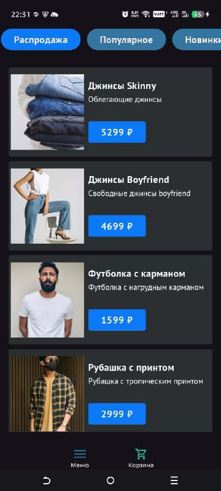
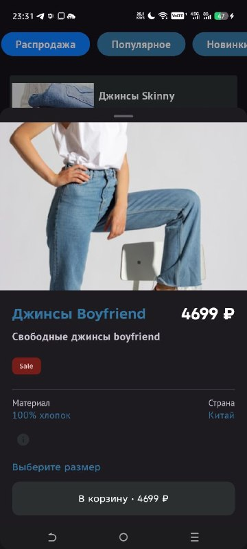
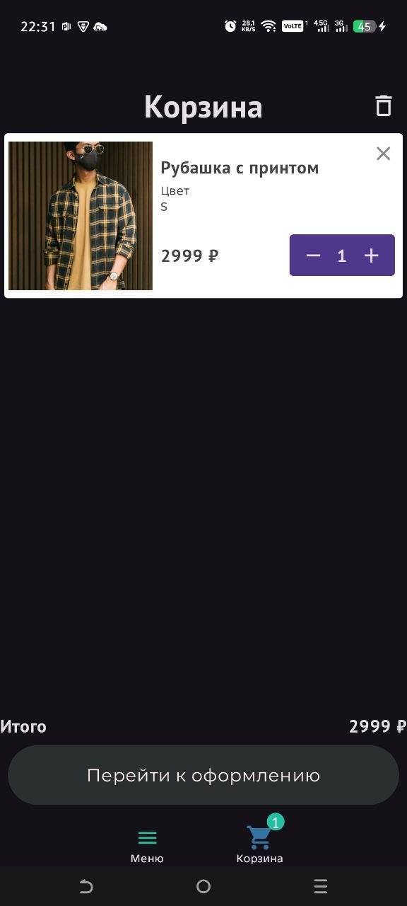
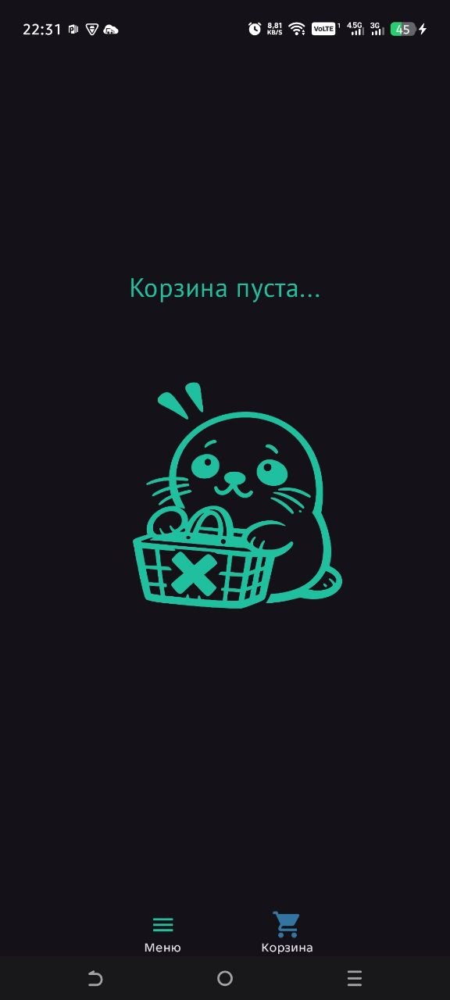

# Seals Market — мобильное приложение интернет-магазина одежды

> Учебный проект в рамках курса по разработке мобильных приложений  
> ДВФУ, ИИПИ, весна 2026

---

## О проекте

**Seals Market** — Android-приложение онлайн-магазина одежды.

Упрощенная версия интернет магазина по продаже одежды, выполненный с водной палитрой
Предусмотрено:
- Фильтрация по типу, материалу, размеру и цене
- Доступ к каталогу товаров с возможностью просмотра подробного описания товаров
- Добавление в корзину и оформление заказа

---

## Команда

| Участник           | Обязанности      |
| ------------------ | --------- |

| Гдалёва Алина     | UI, работа с данными |
| Бурухин Евгений | Архитектура, работа с данными  |
| Лютарь Павел | Дизайн и остальная вспомогательная работа|
---

## 🛠 Стек технологий

- **Платформа:** Android
- **Язык:** Kotlin
- **IDE:** Android Studio
- **Сборка:** Gradle (Kotlin DSL)

---

## Скриншоты

> Скриншоты основных экранов приложения

|  |
|  |
|  |
|  |

---

## Сборка и запуск

### Требования

- Android Studio Hedgehog (2023.1.1) или новее
- JDK 17+
- Android SDK (минимальная версия: указана в `app/build.gradle.kts`)
- Gradle 8.x (входит в комплект через `gradlew`)

### 1. Клонирование репозитория

```bash
git clone https://github.com/FEIP-FEFU-Mobile-Spring-2026/team-primorian-seals.git
cd team-primorian-seals
```

### 2. Открытие в Android Studio

1. Запустите Android Studio
2. Выберите **File → Open**
3. Укажите папку с проектом
4. Дождитесь завершения синхронизации Gradle

### 3. Сборка

Сборка запускается автоматически после синхронизации. Если нужно вручную:

```bash
# Debug-сборка
./gradlew assembleDebug

# Release-сборка
./gradlew assembleRelease

# Полная сборка
./gradlew build
```

Или через меню Android Studio: **Build → Make Project**

### 4. Запуск

**На эмуляторе:**

1. Откройте **Device Manager**
2. Создайте или запустите виртуальное устройство (AVD)
3. Нажмите **Run ** и выберите эмулятор

**На физическом устройстве:**

1. Включите **Режим разработчика** в настройках устройства
2. Активируйте **USB-отладку**
3. Подключите устройство кабелем к компьютеру
4. Разрешите отладку на устройстве
5. Нажмите **Run** и выберите устройство

---

## Структура проекта

```
team-primorian-seals/
├── app/
│   ├── src/
│   │   ├── main/
│   │   │   ├── java/       # Kotlin-код приложения
│   │   │   ├── res/        # Ресурсы (макеты, изображения, строки)
│   │   │   └── AndroidManifest.xml
│   │   └── test/           # Тесты
│   └── build.gradle.kts
├── gradle/
├── screenshots/
├── build.gradle.kts
├── settings.gradle.kts
└── README.md
```

---

## Чеклист выполненных лабораторных

См. [checklist.md](checklist.md)